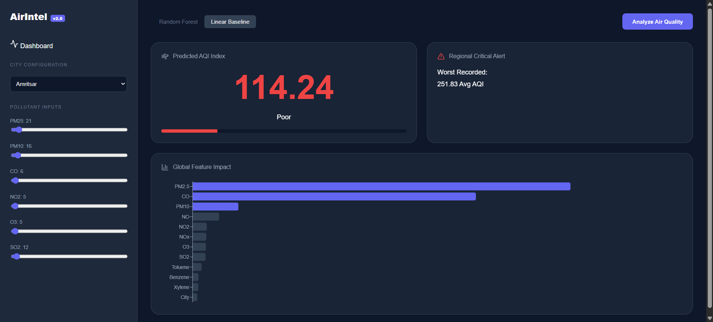

# 🌍 AirIntel — Air Quality Intelligence Dashboard

AirIntel is a production-grade full-stack machine learning application designed to predict and analyze **Air Quality Index (AQI)** across Indian cities.  
It combines a **Random Forest Regressor**, a **FastAPI backend**, and a **modern React dashboard** with built-in explainability.

This project follows real-world ML system design principles and is suitable for academic evaluation, demos, and portfolio showcase.

---

## ✨ Key Features

- 📈 Accurate AQI prediction using Random Forest
- 🧠 Explainable AI with pollutant feature importance
- 🏙️ City-wise air quality insights
- 🎛️ Real-time interactive pollutant sliders
- 🎨 Modern dark-themed glassmorphism UI
- ⚡ FastAPI backend with React frontend

---

## 🏗️ Project Structure

air-quality-intelligence/
├── data/
│ └── air_quality_india.csv
│
├── ml/
│ ├── notebooks/
│ │ └── train_models.ipynb
│ ├── models/
│ └── train_now.py
│
├── backend/
│ ├── app/
│ │ ├── main.py
│ │ ├── model_loader.py
│ │ ├── city_stats.py
│ │ └── schemas.py
│ └── venv/
│
└── frontend/
├── src/
│ ├── App.js
│ └── App.css
└── package.json

---

## 🛠️ Tech Stack

### Machine Learning
- Random Forest Regressor
- Linear Regression (baseline)
- Scikit-learn, Pandas, Joblib

### Backend
- FastAPI
- Uvicorn
- Pydantic

### Frontend
- React
- Axios
- Recharts
- Lucide Icons

---

## 🚀 Installation & Setup

### 1️⃣ Backend & Machine Learning

#### Create & Activate Virtual Environment

cd backend
python -m venv venv

Windows

.\venv\Scripts\activate

macOS / Linux

source venv/bin/activate

#### Install Python Dependencies

pip install --upgrade pip
pip install fastapi uvicorn scikit-learn pandas joblib

---

### 2️⃣ Train the Machine Learning Models

You can train the models using either method below.

#### Option A — Jupyter Notebook (Recommended)

cd ml/notebooks
jupyter notebook

Open `train_models.ipynb` and run all cells.

#### Option B — Standalone Script

cd backend
python ../ml/train_now.py

This generates trained `.pkl` model files inside `ml/models/`.

---

### 3️⃣ Start the Backend API

cd backend
uvicorn app.main:app --reload

Backend URL:http://127.0.0.1:8000

---

## 🎨 Frontend Setup (React)

Open a new terminal:

cd frontend
npm install axios recharts lucide-react
npm start

---

## 🔌 API Endpoints

| Method | Endpoint | Description |
|------|---------|------------|
| POST | /predict | Predict AQI from pollutant values |
| GET | /worst-city | City with worst historical AQI |
| GET | /feature-impact | Pollutant feature contribution |

---

## 🧠 Machine Learning Details

- Primary Model: Random Forest Regressor
- Baseline Model: Linear Regression
- Explainability: Gini Feature Importance
- Target Variable: AQI (continuous regression)

### Pollutants Used
- PM2.5
- PM10
- NO
- NO₂
- NOx
- CO

---

## 🎛️ Dashboard Capabilities

- Real-time AQI prediction
- Pollutant impact visualization
- City-wise AQI analysis
- Responsive dark UI with glassmorphism design

---

## 🧪 Execution Summary

Backend

cd backend 
uvicorn app.main:app --reload

Frontend

cd frontend 
npm start

---

## 📌 Future Enhancements

- AQI category classification (Good / Moderate / Poor)
- Time-series AQI forecasting
- Interactive map visualization
- Cloud deployment (AWS / Azure)
- Model monitoring and drift detection

---

## Sample Screenshot

## 🧑‍💻 Author

**Abhyuday Sinha**  
Full-Stack Development | Machine Learning | Data Systems

---